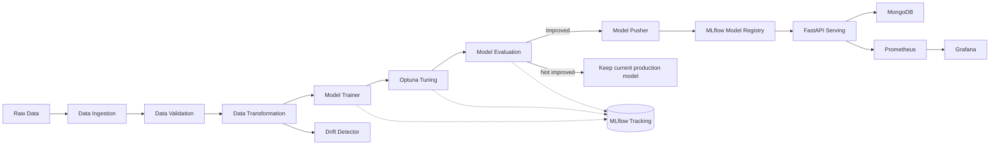

# Churn Prediction — Production-Ready MLOps Pipeline


An end-to-end MLOps pipeline for customer churn prediction: data ingestion through validation, feature engineering, multi-model training with hyperparameter tuning, experiment tracking, a model registry, and data drift monitoring — built with the same tooling used in production ML teams (MLflow, DVC, Optuna) rather than a notebook-only demo.

## Why churn prediction

The spec this was built from asked for feature engineering that includes outlier handling and heavy categorical encoding. Churn is the cleanest fit for that: 15 categorical columns, a real class balance question, and no conceptual conflict — fraud detection would actually fight with generic outlier removal, since fraud cases *are* the outliers you want to keep.

## Architecture



Solid arrows (A–J, O) are built and verified below. Dotted arrows (K–N) are the serving/observability layer built in stage 2.

## Tech stack

| Layer | Tools |
|---|---|
| Language | Python 3.12 |
| ML | pandas, NumPy, scikit-learn, XGBoost, LightGBM, Optuna |
| Tracking / Registry | MLflow (SQLite-backed) |
| Versioning | DVC |
| API | FastAPI |
| Database | MongoDB |
| Containers | Docker, Docker Compose |
| CI/CD | GitHub Actions |
| Cloud | AWS EC2, S3 |
| Monitoring | Prometheus, Grafana |
| Logging | Loguru |
| Testing | Pytest |

## Project structure

```
mlops-pipeline/
├── app/                          # FastAPI service (Stage 2)
│   ├── main.py                   #   routes: predict, train, metrics, health, etc.
│   ├── schemas.py                #   Pydantic request/response models
│   ├── services.py               #   prediction + training service wrappers
│   ├── database.py               #   MongoDB client (predictions, experiments, logs)
│   └── utils.py                  #   config loader
├── configs/schema.yaml           # column/dtype schema used by validation
├── config.yaml                   # service-level config (API, Mongo, MLflow, monitoring)
├── params.yaml                   # tunable ML params, tracked by DVC
├── dvc.yaml                      # reproducible pipeline stages
├── data/raw/, data/ingested/     # generated dataset + train/test split
├── models/production/            # promoted model + preprocessor + registry.json
├── src/
│   ├── constants/                # fixed names/paths/seeds
│   ├── entity/                   # config + artifact dataclasses
│   ├── utils/                    # logger, custom exception, I/O helpers
│   ├── components/               # the 6 pipeline stages + drift detector
│   └── pipeline/                 # training_pipeline.py, prediction_pipeline.py
├── dashboard/index.html          # Bootstrap 5 monitoring dashboard
├── monitoring/                   # Prometheus + Grafana config
├── scripts/
│   ├── run_drift_check.py        # standalone drift-report demo
│   └── deploy_ec2.sh             # AWS EC2 deployment script
├── tests/                        # unit + integration tests
├── Dockerfile                    # multi-stage container build
├── docker-compose.yml            # API + MongoDB + Prometheus + Grafana
├── .github/workflows/ci.yml      # CI/CD pipeline
├── .github/ISSUE_TEMPLATE/       # bug + feature templates
├── .github/PULL_REQUEST_TEMPLATE.md
└── CONTRIBUTING.md               # contributor guide
```

## Features

- [x] Data ingestion — CSV / URL / MongoDB / REST API / synthetic generator (strategy pattern, one interface)
- [x] Data validation — schema, dtype, null, duplicate checks + train/test sanity drift check
- [x] Feature engineering — median/mode imputation, one-hot encoding, standard scaling, IQR outlier capping, variance-based feature selection
- [x] Model training — Logistic Regression, Random Forest, Gradient Boosting, XGBoost, LightGBM compared automatically
- [x] Hyperparameter tuning — Optuna, 5-fold stratified CV, seeded for reproducibility
- [x] Evaluation — accuracy, precision, recall, F1, ROC-AUC, confusion matrix
- [x] Experiment tracking — MLflow, every baseline + tuned run logged
- [x] Model registry — auto-registration + promotion gate (only replaces production if it actually improves)
- [x] Dataset/pipeline versioning — DVC, `dvc repro` runs the whole thing reproducibly
- [x] Data drift detection — KS-test/Chi-square vs. training reference, dark-themed HTML report
- [x] Unit + integration tests — 12 passing
- [x] REST API (FastAPI) — `POST /predict`, `POST /predict/batch`, `POST /train`, `GET /metrics`, `GET /health`, `GET /version`, `GET /model-info`, `GET /drift-report`, `GET /dashboard`
- [x] MongoDB integration — predictions, experiments, logs collections with graceful fallback
- [x] Docker + Docker Compose — API, MongoDB, Prometheus, Grafana as one stack
- [x] CI/CD (GitHub Actions) — install, test, lint, build, push, deploy
- [x] Monitoring (Prometheus/Grafana) — CPU, memory, request rate, latency, prediction count
- [x] Dashboard (Bootstrap 5) — overview, predict, training, metrics, monitoring, model registry pages
- [x] AWS deployment scripts — `scripts/deploy_ec2.sh` with rsync + docker compose
- [x] GitHub templates — issue templates, PR template, CONTRIBUTING.md

## Getting started

```bash
git clone <your-repo-url>
cd mlops-pipeline
pip install -r requirements.txt

# Run the full pipeline directly
python -m src.pipeline.training_pipeline

# ...or reproducibly via DVC
dvc init      # already done if you cloned this repo as-is
dvc repro

# Run tests
pytest -v

# Generate a drift report against a simulated new batch
python scripts/run_drift_check.py

# Start the FastAPI server
python -m app.main

# Open the dashboard
open http://localhost:8000/dashboard
```

To use a real dataset instead of the synthetic generator, drop a CSV with the same 21 columns at `data/raw/churn_data.csv` and set `DATA_SOURCE=csv` (see `.env.example`). The IBM/Kaggle Telco Customer Churn dataset matches this schema directly.

## Docker

```bash
# Build and start all services (API + MongoDB + Prometheus + Grafana)
docker compose up -d

# View logs
docker compose logs -f api

# Stop everything
docker compose down
```

## API Endpoints

| Method | Path | Description |
|---|---|---|
| GET | `/` | Root — service info |
| GET | `/health` | Health check |
| GET | `/version` | App + model version |
| POST | `/predict` | Single customer prediction (query params) |
| POST | `/predict/batch` | Batch prediction (JSON body) |
| POST | `/train` | Trigger training pipeline |
| GET | `/metrics` | Model evaluation metrics |
| GET | `/model-info` | Production model metadata |
| GET | `/drift-report` | Latest drift detection report (HTML) |
| GET | `/dashboard` | Bootstrap 5 monitoring dashboard |
| GET | `/docs` | Swagger UI |

## Results

Verified from an actual run — 5,000 synthetic customers (49.78% churn), 4,000/1,000 train/test split, 44 features after encoding.

**Baseline comparison** (test set):

| Model | Accuracy | Precision | Recall | F1 | ROC-AUC |
|---|---|---|---|---|---|
| **Logistic Regression** | 0.783 | 0.778 | 0.789 | **0.784** | 0.863 |
| Gradient Boosting | 0.773 | 0.769 | 0.777 | 0.773 | 0.856 |
| Random Forest | 0.756 | 0.751 | 0.763 | 0.757 | 0.831 |
| LightGBM | 0.742 | 0.732 | 0.761 | 0.746 | 0.842 |
| XGBoost | 0.741 | 0.732 | 0.757 | 0.744 | 0.821 |

Logistic Regression won — worth knowing for an interview: the synthetic generator builds churn probability as a linear-in-log-odds function of the features, so logistic regression is the correctly-specified model for this particular data-generating process. On a real (non-synthetic) dataset, tree ensembles would likely edge it out due to real-world nonlinearities and feature interactions.

**After Optuna tuning** (25 trials, 5-fold CV, best `C=0.0925`):

| | Accuracy | Precision | Recall | F1 | ROC-AUC |
|---|---|---|---|---|---|
| Final model (test set) | 0.776 | 0.773 | 0.779 | 0.776 | 0.862 |

Note the tuned F1 (0.776) is slightly below the untuned baseline's test F1 (0.784) — this is expected and worth understanding rather than hiding: Optuna selected `C` based on cross-validated F1 (0.767), which is a more robust generalization estimate than a single train/test split. The untuned baseline simply got a favorable draw on this particular test split. This is exactly why CV-based tuning is preferred over eyeballing a single holdout score.

**Drift detection demo** — comparing training data against a simulated batch with a pricing change + fiber-internet push: **3 of 21 features flagged** (`tenure`, `InternetService`, `MonthlyCharges`) — precisely the three that were shifted, with zero false positives on the other 18.

**Tests**: 12/12 passing (`pytest -v`, ~14s).

## Reproducibility

Model training uses a fixed random seed (42) throughout — data generation, train/test split, cross-validation folds, and the Optuna sampler (`TPESampler(seed=42)`). Running `dvc repro` twice with unchanged code and params reproduces the same baseline metrics.

## Roadmap (stage 3)

1. Kubernetes deployment (EKS) — Helm charts, horizontal pod autoscaling
2. A/B testing framework — route % of traffic to candidate models
3. Feature store (Feast or similar) — centralized feature definitions + serving
4. Model explainability — SHAP/LIME integration in API responses
5. Automated retraining — schedule-based or drift-triggered retraining
6. Multi-environment deployment — dev/staging/prod with Terraform
7. End-to-end integration tests with test containers

## License

MIT — see [LICENSE](LICENSE).
